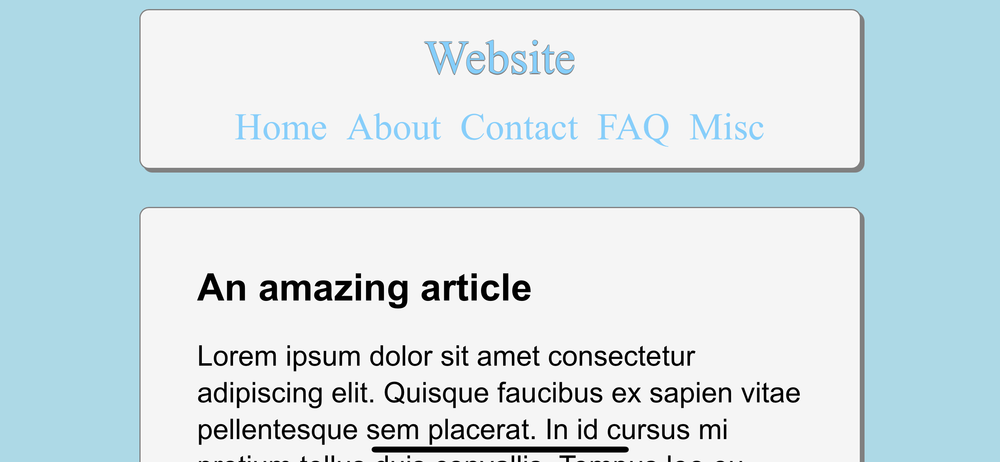

# Mobile-First Site Layout

After my last little project (the sidebar), I wanted to try something more 'mobile-first'. This is the result of that.

## How it looks

### Mobile

Portrait

 

Landscape

### Desktop

Full width

Reduced window width

## Conclusion

My idea of pursuing 'mobile-first' was to let the constraints of the mobile UI dictate the layout on the desktop, eg by not including a sidebar. However, for aesthetic reasons, I was drawn to having the title on the left of the header, and the nav items on the right. But if I truly wanted to let mobile dictate the layout, then the title should have sat above the nav items, whether centred or to the left. That would have been the easier approach for sure. However, a distinction between portrait and landscape still would have been warranted, if nothing else because of the need for the margins. Without constraining the content on landscape, the lines of text would be very long, which would potentially reduce the user-experience. At which point, we're not far off using pure HTML :)) Plus, the spacing between the header items differs between mobile portrait and the landscape modes. At the end of the day, they're all just very different resolutions to be working with.

*~Marc Reed*